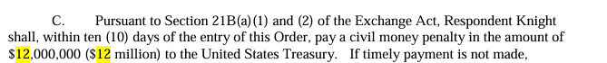

# Caça ao desastre: Knight Capital (2012)

**Estudante:** João Paulo de Albuquerque Alves
**Disciplina:**  Teste eQualidade de Software, ADS, IFCE Campus Boa Viagem
**Unidade I:** Fundamentos da qualidade de software

> Apague as instruções entre colchetes e os textos em itálico ao preencher.

---

## 1. Resumo do caso

*Em até 2 parágrafos: o que aconteceu, quando, onde, qual sistema estava envolvido e quais foram as consequências (humanas, financeiras, sociais).*

[Em 1º de agosto de 2012, na Bolsa de Valores de Nova York (NYSE), a corretora Knight Capital sofreu um desastre operacional quando uma atualização manual no SMARS — seu sistema automatizado de roteamento de ordens — deixou 1 de seus 8 servidores sem o novo código, reativando acidentalmente um algoritmo obsoleto (Power Peg) que executou mais de 4 milhões de negociações errôneas em loop ao longo de apenas 45 minutos. Essa falha gerou um prejuízo direto de US$ 440 milhões, destruiu mais de 75% do valor de mercado da empresa em dois dias e custou uma multa de US$ 12 milhões aplicada pela SEC, levando à perda de empregos, ao afastamento da liderança executiva e ao fim da companhia como entidade independente após ser vendida às pressas para a Getco]

## 2. Linha do tempo

*Mínimo de 5 eventos, do desenvolvimento do sistema até as consequências e correções.*

| Data | Evento |
|---|---|
| [data] | [evento] |
| [data] | [evento] |
| [data] | [evento] |
| [data] | [evento] |
| [data] | [evento] |

## 3. Causa técnica

*Explique qual foi o defeito no software, em linguagem que um colega de turma entenda. Se possível, mostre um trecho de código, pseudocódigo ou cálculo que ilustre o problema. Diferencie o defeito (a imperfeição no artefato) da falha (o comportamento incorreto observado).*

[escreva aqui]

## 4. Análise com os conceitos da Unidade I

### 4.1 Verificação e validação

*A falha aconteceu porque o produto não atendia à especificação (falha de verificação), porque a especificação não atendia à necessidade real (falha de validação), ou ambos? Justifique.*

[escreva aqui]

### 4.2 Garantia da qualidade (QA) e controle da qualidade (QC)

*Que atividade preventiva de processo (QA) faltou ou falhou? Que atividade de detecção no produto (QC), como revisão, inspeção ou teste, poderia ter encontrado o defeito?*

[escreva aqui]

### 4.3 Custo da não qualidade

*Classifique os custos do caso pelo modelo PAF. Nas linhas de falha, use os custos reais do caso. Nas linhas de prevenção e avaliação, descreva o que poderia ter sido investido.*

| Categoria | O que aconteceu ou o que poderia ter sido feito | Custo (se conhecido) |
|---|---|---|
| Prevenção | [ ] | [ ] |
| Avaliação | [ ] | [ ] |
| Falha interna | [ ] | [ ] |
| Falha externa | [ ] | [ ] |

### 4.4 Visões de Garvin

*Qual visão de qualidade (transcendental, usuário, fabricante, produto, valor) foi priorizada por quem desenvolveu ou decidiu? Qual visão foi ignorada? Justifique com fatos do caso.*

[escreva aqui]

### 4.5 Produto ou processo?

*O problema foi principalmente de qualidade de produto, de qualidade de processo, ou dos dois? Quais características da ISO/IEC 25010 foram afetadas (ex.: adequação funcional, confiabilidade, segurança)?*

[escreva aqui]

## 5. O que poderia ter evitado a falha

*Liste de 2 a 4 práticas de qualidade concretas e explique como cada uma teria evitado ou reduzido o problema.*

1. [prática]: [como teria ajudado]
2. [prática]: [como teria ajudado]

## 6. O que a IA errou ou não sabia

*Liste as afirmações relevantes que a IA fez sobre o caso e o resultado da sua checagem. Mínimo de 6 afirmações. Classificação: **Confirmada**, **Errada**, **Imprecisa** ou **Não verificável**.*

| # | Afirmação da IA | Classificação | O que a fonte diz | Fonte |
|---|---|---|---|---|
| 1 | [Causa Técnica: Código Morto (Reused Flag) O sistema SMARS possuía uma funcionalidade antiga (chamada Power Peg), desativada anos antes em 2003, mas cujo código interno nunca fora removido por completo. A nova funcionalidade para o programa RLP reutilizou a mesma flag (parâmetro) que no passado ativava o Power Peg. ] | [Confirmada ] | [ O código RLP reutilizou uma bandeira que antes era usada para ativar uma função antiga conhecida como 'Power Peg'. Ordens enviadas com a bandeira reaproveitada para o oitavo servidor acionaram o código Power Peg defeituoso ainda presente naquele servidor.] | [Wikipedia ] |
| 2 | [Horário do ocorrido: 1º de agosto de 2012, logo na abertura do mercado, entre 09:30 e 10:15 (horário local). ] | [Não verificavel ] | [Menciona data, mas não horário estimado ] | [Wikipedia ] |
| 3 | [ Multa de US$ 12 milhões aplicada pela SEC por descumprimento da Market Access Rule.] | [Confirmada ] | [ ] | [FEC ] |
| 4 | [ ] | [ ] | [ ] | [ ] |
| 5 | [ ] | [ ] | [ ] | [ ] |
| 6 | [ ] | [ ] | [ ] | [ ] |

**Reflexão (1 parágrafo):** *Com base nessa checagem, o quanto você confiaria na IA para investigar uma falha de software no seu futuro trabalho? Que tipo de erro ela mais cometeu?*

[Baseado no trabalho desenvolvido, dá pra confiar na IA como uma grande biblioteca digital, ela trás dados de forma rápida mas nem sempre precisa, dá pra confiar mas não cegamente. utilizando-a como parceira em estudos, projetos de pesquisa amplia e agiliza o desenvolvimento de atividades]

## 7. Fontes

*Formato ABNT. Mínimo de 2 fontes primárias (relatório oficial de investigação, documento de órgão regulador, artigo científico ou notícia da época). Indique quais são as primárias.*

1. [https://www.sec.gov/files/litigation/admin/2013/34-70694.pdf] **(primária)** Relatório da SEC
2. [https://en.wikipedia.org/wiki/Knight_Capital_Group] **(primária)** Wikipedia
